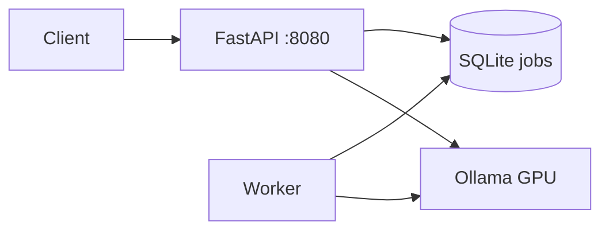

# INFER_HUB


Платформа для **локального GPU-инференса** через Ollama: REST API, очередь задач с приоритетами, фоновый worker, метрики и Docker.

**Repo:** https://github.com/sxtr333/INFER_HUB

Сделано для нагрузки на **видеокарту**, не на процессор. CPU ограничен (**макс. 75%**).

📄 [Architecture](ARCHITECTURE.md) · 🎤 [Interview guide](INTERVIEW.md) · 📖 [OpenAPI /docs](http://127.0.0.1:8080/docs)

---

## Зачем это нужно

Один Ollama на машине — много клиентов. INFER_HUB принимает запросы, ставит их в очередь, worker гоняет inference на GPU и отдаёт результат через API или SSE-стрим.

Подходит как:
- inference gateway для своих ботов и сервисов
- очередь LLM-задач с retry и circuit breaker
- пример mid-level backend: async API + worker + observability

---

## Что внутри

| Компонент | Описание |
|-----------|----------|
| **FastAPI** | REST API, SSE streaming, rate limit, optional API key |
| **SQLite queue** | Приоритеты 1–10, batch claim, retry, TTL purge |
| **GPU Worker** | Ollama `/api/generate`, `num_gpu` layers, warm-up модели |
| **Circuit breaker** | Отключает Ollama при серии ошибок |
| **Prometheus** | `/metrics` — HTTP counters, глубина очереди |
| **Docker Compose** | API + worker + Redis (optional stack) |

---

## Архитектура



1. `POST /v1/jobs` — задача в очередь  
2. Worker забирает batch по priority  
3. Inference на GPU через Ollama  
4. `GET /v1/jobs/{id}` или `/stream` — результат  

---

## Быстрый старт

```bash
git clone git@github-cars:sxtr333/INFER_HUB.git
cd INFER_HUB

python3 -m venv .venv
source .venv/bin/activate
pip install -r requirements.txt
cp .env.example .env
./scripts/setup.sh   # подсказки по ключам

# терминал 1 — API
./scripts/run_api.sh

# терминал 2 — worker (GPU)
./scripts/run_worker.sh
```

### Отправить задачу

```bash
curl -s -X POST http://127.0.0.1:8080/v1/jobs \
  -H 'Content-Type: application/json' \
  -d '{"prompt":"Объясни что такое flip-маржа одним абзацем","priority":8}' | jq

# статус
curl -s http://127.0.0.1:8080/v1/jobs/JOB_ID | jq
```

### Health & metrics

```bash
curl -s http://127.0.0.1:8080/health | jq
curl -s http://127.0.0.1:8080/metrics | head
```

### Демо одной командой

```bash
./scripts/demo.sh
```

### Нагрузочный тест (10 задач)

```bash
./scripts/load_test.sh 10
```

---

## API ключ — что вставлять

| Сервис | Нужен ключ? | Что писать в `.env` |
|--------|-------------|---------------------|
| **INFER_HUB** (твой API) | Опционально | `API_KEY=` **пусто** — проще всего для демо |
| | Или для «как в проде» | `API_KEY=sxtr333-infer-demo` + заголовок `X-API-Key` |
| **Ollama** (локально) | **Нет** | ничего, только `OLLAMA_URL=http://127.0.0.1:11434` |

**Ollama не использует API key** на локальной машине.

**Для портфолио / скриншотов** — оставь `API_KEY` пустым, тогда:

```bash
curl -X POST http://127.0.0.1:8080/v1/jobs \
  -H 'Content-Type: application/json' \
  -d '{"prompt":"Привет"}'
```

**Если ключ включён** (`API_KEY=sxtr333-infer-demo`):

```bash
curl -X POST http://127.0.0.1:8080/v1/jobs \
  -H 'Content-Type: application/json' \
  -H 'X-API-Key: sxtr333-infer-demo' \
  -d '{"prompt":"Привет"}'
```

Или через env без правки `.env` каждый раз:

```bash
export INFER_HUB_API_KEY=sxtr333-infer-demo
./scripts/demo.sh
```

---

## API

| Метод | Путь | Описание |
|-------|------|----------|
| GET | `/health` | Ollama + очередь + worker alive |
| GET | `/metrics` | Prometheus |
| POST | `/v1/jobs` | Создать задачу |
| POST | `/v1/jobs/batch` | До 32 задач разом |
| GET | `/v1/jobs` | Список задач |
| GET | `/v1/jobs/{id}` | Статус и результат |
| GET | `/v1/jobs/{id}/stream` | SSE стрим |
| DELETE | `/v1/jobs/{id}` | Отмена pending |

Если в `.env` задан `API_KEY` — заголовок `X-API-Key`.

---

## Настройки (.env)

| Переменная | По умолчанию | Смысл |
|------------|--------------|-------|
| `CPU_LIMIT_PCT` | 70 | Потолок CPU (не выше 75) |
| `OLLAMA_GPU_LAYERS` | 999 | Слои на GPU |
| `OLLAMA_MODEL` | darkidol-russian:latest | Модель |
| `WORKER_BATCH_SIZE` | 4 | Задач за проход |
| `WORKER_MAX_RETRIES` | 3 | Retry при ошибке Ollama |
| `RATE_LIMIT_RPM` | 60 | Лимит запросов на IP |

---

## Docker

```bash
docker compose up --build
```

Ollama должен быть на хосте (`11434`). Worker и API ходят на `host.docker.internal`.

---

## Тесты

```bash
pip install -r requirements-dev.txt
pytest -q
```

---

## Стек

Python 3.12 · FastAPI · httpx · aiosqlite · Prometheus · Ollama · Docker

---

## Автор

[@sxtr333](https://github.com/sxtr333)

MIT
